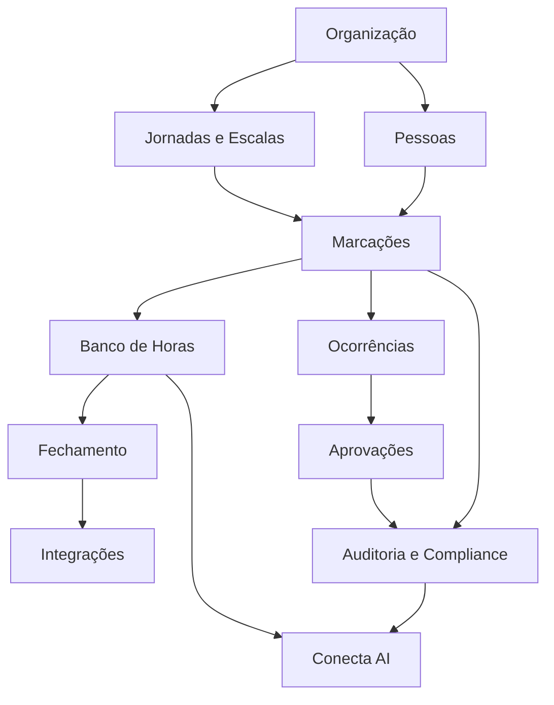

# Modelo de Domínio

O modelo de domínio representa os conceitos centrais do produto e seus relacionamentos, independentemente da tecnologia utilizada na implementação.

## Domínios principais

## Entidades nucleares

| Entidade | Responsabilidade |
|---|---|
| Empresa | Tenant e contexto principal de segregação |
| Unidade | Local organizacional ou operacional |
| Colaborador | Pessoa vinculada a contrato, unidade e estrutura |
| Jornada | Regras de carga horária, tolerância e intervalo |
| Escala | Distribuição temporal de turnos, folgas e plantões |
| Marcação | Evento imutável de entrada, intervalo, retorno ou saída |
| Ocorrência | Exceção detectada ou informada na jornada |
| Solicitação | Pedido de ajuste, compensação ou justificativa |
| Aprovação | Decisão humana sobre uma solicitação |
| Banco de Horas | Livro-razão de créditos, débitos e compensações |
| Competência | Período mensal de apuração |
| Espelho de Ponto | Documento consolidado da competência |
| Regra | Configuração versionada aplicada ao cálculo |
| Evento de Auditoria | Registro imutável de ação e alteração |

## Agregados sugeridos

### Agregado Jornada do Colaborador

Raiz: `ColaboradorJornada`

Inclui:

- vínculo de jornada;
- escala vigente;
- exceções temporárias;
- calendário aplicável;
- regras sindicais;
- vigência e histórico.

### Agregado Registro de Ponto

Raiz: `Marcacao`

Inclui:

- data e hora;
- tipo;
- origem;
- dispositivo;
- localização;
- evidências;
- integridade e assinatura;
- vínculo com ocorrência.

### Agregado Banco de Horas

Raiz: `ContaBancoHoras`

Inclui:

- lançamentos;
- regras de validade;
- créditos;
- débitos;
- compensações;
- expiração;
- saldo por competência.

## Invariantes essenciais

1. Uma marcação original nunca é excluída fisicamente.
2. Ajustes geram uma nova versão e mantêm o valor anterior.
3. Competências fechadas são imutáveis até reabertura autorizada.
4. Toda regra aplicada ao cálculo deve possuir versão identificável.
5. O saldo do banco de horas é derivado dos lançamentos, nunca editado diretamente.
6. Um gestor só aprova registros pertencentes ao seu escopo de equipe.
7. Todas as operações críticas geram evento de auditoria.
