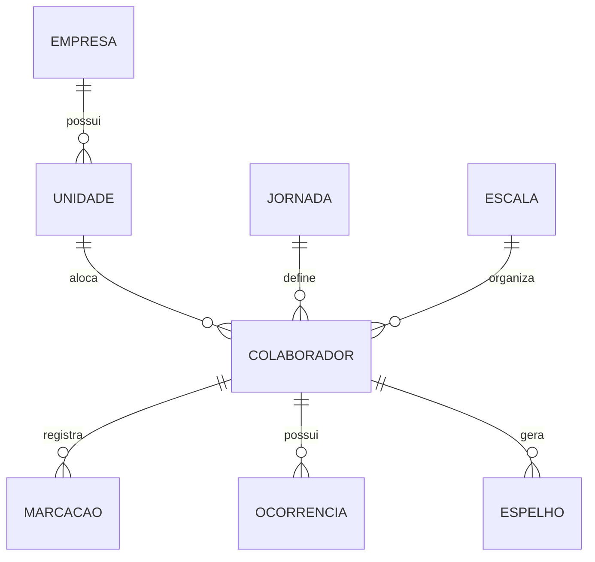

# Banco de Dados

```mermaid
erDiagram
    EMPRESA ||--o{ UNIDADE : possui
    UNIDADE ||--o{ COLABORADOR : aloca
    COLABORADOR ||--o{ MARCACAO : registra
    COLABORADOR ||--o{ OCORRENCIA : possui
    COLABORADOR ||--o{ ESPELHO : gera
    JORNADA ||--o{ COLABORADOR : define
    ESCALA ||--o{ COLABORADOR : organiza
```
