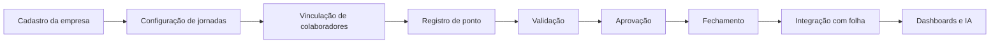

# Conecta Gestão de Jornada

## Documentação oficial do produto

Este portal centraliza:

- arquitetura;
- requisitos;
- banco de dados;
- APIs;
- UX/UI;
- decisões arquiteturais;
- roadmap;
- implantação;
- testes e homologação.

