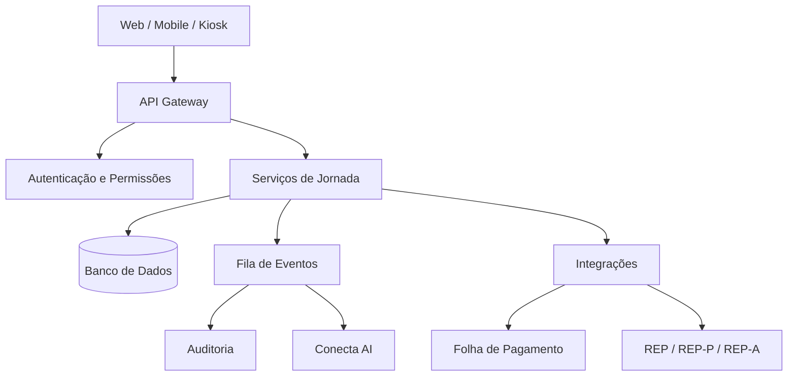

# Arquitetura Geral

```mermaid
flowchart TB
    UI[Web / Mobile / Kiosk] --> API[API Gateway]
    API --> AUTH[Autenticação e Permissões]
    API --> CORE[Serviços de Jornada]
    CORE --> DB[(Banco de Dados)]
    CORE --> EVENTS[Fila de Eventos]
    EVENTS --> AUDIT[Auditoria]
    EVENTS --> AI[Conecta AI]
    CORE --> INT[Integrações]
    INT --> PAYROLL[Folha de Pagamento]
    INT --> REP[REP / REP-P / REP-A]
```

## Princípios

- fonte única de dados;
- separação por domínios;
- APIs versionadas;
- auditoria imutável;
- segurança por perfil.
