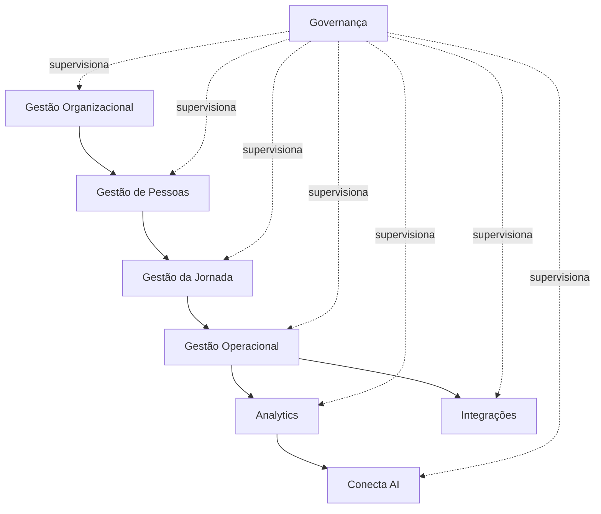

# Business Capability Model

# Objetivo

O Business Capability Model (BCM) representa todas as capacidades que o Conecta Gestão de Jornada oferece às organizações.

Diferentemente dos módulos, uma capacidade representa **o que o produto é capaz de fazer**, independentemente de como essa funcionalidade será implementada.

---

# Camadas de Capacidades

## Nível 1 — Estratégico

Representa as grandes capacidades do produto.

```
Conecta Gestão de Jornada

├── Gestão Organizacional
├── Gestão de Pessoas
├── Gestão da Jornada
├── Gestão Operacional
├── Governança
├── Analytics
├── Integrações
└── Inteligência Artificial
```

---

# Gestão Organizacional

Responsável pela estrutura da empresa.

Capacidades:

- Empresas
- Unidades
- Departamentos
- Centros de Custo
- Calendários
- Feriados
- Estrutura Organizacional

---

# Gestão de Pessoas

Responsável pelos usuários do sistema.

Capacidades:

- Colaboradores
- Contratos
- Gestores
- Perfis
- Permissões
- Equipes

---

# Gestão da Jornada

Controla todas as regras relacionadas ao trabalho.

Capacidades:

- Jornadas
- Turnos
- Escalas
- Plantões
- Revezamentos
- Banco de Horas
- Tolerâncias
- Políticas

---

# Gestão Operacional

Executa o dia a dia da jornada.

Capacidades:

- Registro de ponto
- Registro offline
- QR Code
- Reconhecimento facial
- Geolocalização
- Solicitações
- Aprovações
- Espelho de ponto
- Fechamento

---

# Governança

Responsável pela segurança do produto.

Capacidades:

- Auditoria
- Logs
- Versionamento
- Configurações
- LGPD
- Compliance
- Trilha de alterações

---

# Analytics

Transforma dados em indicadores.

Capacidades:

- Dashboards
- KPIs
- Comparativos
- Tendências
- Indicadores
- Exportações

---

# Integrações

Permite comunicação com outros sistemas.

Capacidades:

- APIs REST
- Webhooks
- REP
- ERP
- Folha
- Active Directory
- SSO

---

# Inteligência Artificial

Camada inteligente da plataforma.

Capacidades:

- Insights
- Recomendações
- Alertas
- Explicação de indicadores
- Predições
- Assistente Virtual

---

# Relacionamento entre Capacidades



---

# Evolução das Capacidades

Todas as futuras funcionalidades deverão fortalecer uma dessas capacidades.

Nenhuma funcionalidade poderá existir sem estar vinculada ao Business Capability Model.

---

# Benefícios

A utilização do BCM garante:

- visão estratégica do produto;
- crescimento organizado;
- redução de duplicidade;
- facilidade de manutenção;
- clareza para desenvolvimento;
- melhor governança da arquitetura.

---

# Conclusão

O Business Capability Model será utilizado como referência para priorização do backlog, definição de roadmap, arquitetura de software e organização da documentação técnica do Conecta Gestão de Jornada.
