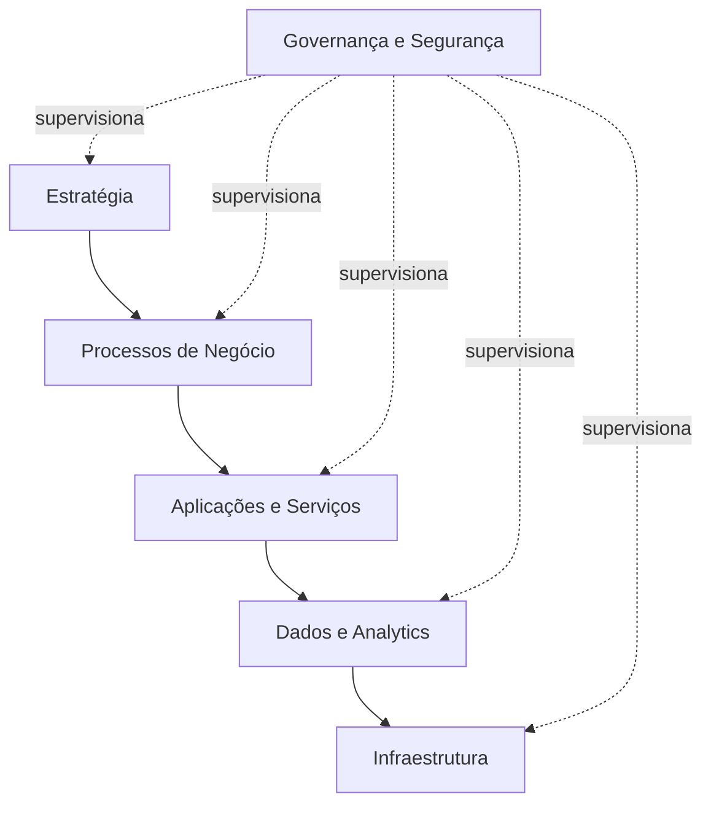

# Arquitetura Corporativa

## Capacidades de negócio

| Capacidade | Resultado esperado |
|---|---|
| Registrar jornada | Marcações confiáveis |
| Planejar escalas | Cobertura operacional |
| Apurar horas | Cálculo consistente |
| Tratar exceções | Ajustes rastreáveis |
| Aprovar solicitações | Decisão por alçada |
| Fechar competência | Consolidação segura |
| Integrar folha | Eventos corretos |
| Monitorar indicadores | Visão em tempo real |
| Auditar operações | Evidências completas |
