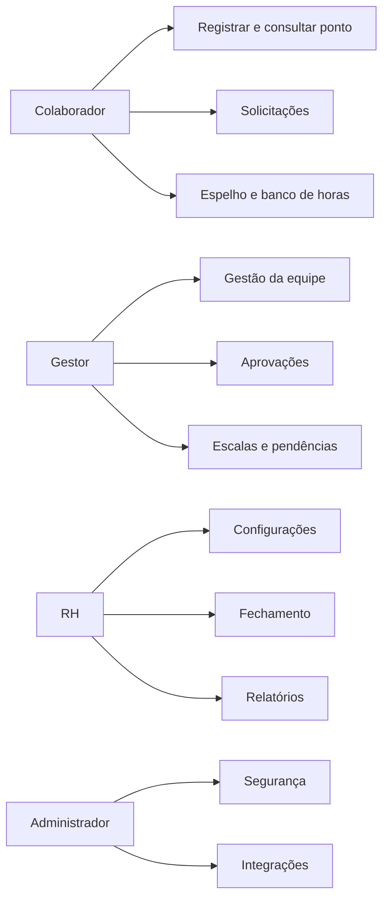

# Arquitetura Funcional Detalhada

## Visão por perfil

## Módulos

| Módulo | Funções |
|---|---|
| Dashboard | KPIs, alertas e IA |
| Controle de Ponto | Registro e histórico |
| Jornadas | Regras e vigências |
| Escalas | Turnos, folgas e plantões |
| Banco de Horas | Saldo e compensações |
| Ocorrências | Detecção e tratamento |
| Solicitações | Ajustes e justificativas |
| Aprovações | Fila, alçada e histórico |
| Espelho | Competência e assinatura |
| Fechamento | Consolidação e bloqueio |
| Relatórios | Operacionais e gerenciais |
| Configurações | Regras e integrações |
| Auditoria | Logs e evidências |
| Conecta AI | Insights e previsões |
