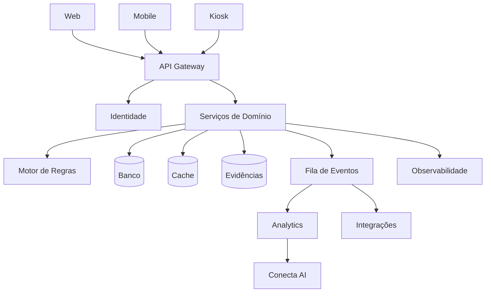

# Arquitetura Técnica

## Requisitos não funcionais

- disponibilidade alvo de 99,9%;
- isolamento multiempresa;
- criptografia em trânsito e repouso;
- idempotência;
- rastreabilidade por `correlation_id`;
- filas com retentativa;
- backup automático;
- suporte a fusos horários;
- interface responsiva.
